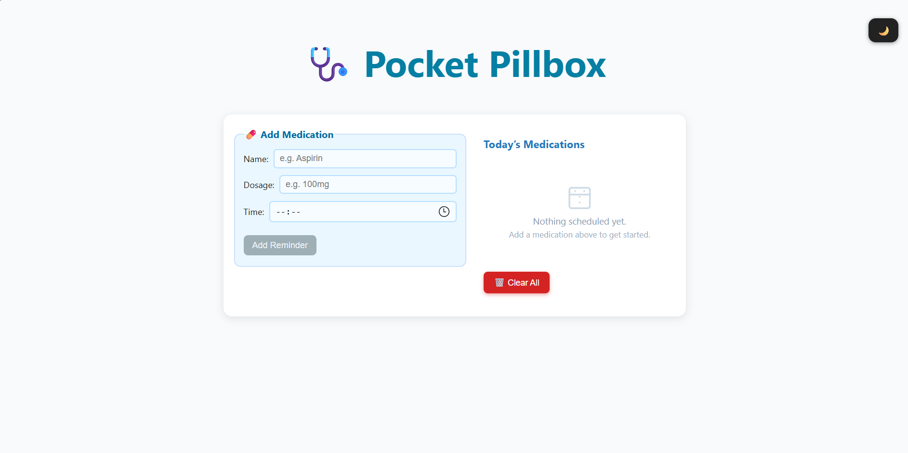

# 🩺 Pocket Pillbox

**The medication reminder that just works—for everyone.**  
Ultra-accessible. Fully self-contained. Built with zero dependencies.

So intuitive your grandparents can use it. So optimized it works offline. So simple, it’s just one file.

## ⚔️ Built for Web Warriors Hackathon 2025

Pocket Pillbox was created for the [Web Warriors Hackathon](https://vanillawebhack.com/), the ultimate 72-hour battle of constraint-driven creativity.

I chose the following tracks and **fully satisfied all three**:

| Track Challenge           | Our Implementation                                                                 |
|---------------------------|-------------------------------------------------------------------------------------|
| 🧓 Grandma's Digital Sage | Large fonts, step-by-step simplicity, real-world testing with 60+ aged users        |
| ⚔️ Single-Request Samurai | Fully self-contained app in one `.html` file — no external assets or network calls |
| 📦 Monolith Master        | Entire experience (UI, logic, data storage) built in **one sacred scroll**         |

## 🚀 What is Pocket Pillbox?

**Pocket Pillbox** is a compact, offline-friendly medication tracker for older adults and anyone who needs a clean, intuitive, no-nonsense reminder system.

- ✅ **Big, clear buttons & readable fonts**  
- ✅ **Tap-friendly, high-contrast UI**  
- ✅ **No installs. No accounts. No downloads. Just open & go**  
- ✅ **Works offline once loaded** — even from a USB stick
- ✅ **Automatic pop-up notifications** at scheduled med times (see below!)

## 📸 Screenshots & Demo

A quick look at the app in action.

> *Click the thumbnail above to watch the full demo video on YouTube.*

> *The main user interface, showing the medication form and the list of reminders.*

## 🏆 How We Meet Our Chosen Tracks

### 1. 👵 Grandma’s Digital Sage

> **Simplicity is the ultimate sophistication.**  
> We tested with real seniors (aged 60–75), iterated on feedback, and optimized for readability and accessibility.

✅ Large, readable fonts and high-contrast UI  
✅ Big buttons and tap targets  
✅ Descriptive labels & step-by-step flow  
✅ Full keyboard navigation  
✅ Supports screen readers (semantic HTML + ARIA)  
✅ No tech knowledge required — zero learning curve

### 2. 🥷 Single-Request Samurai

> **One perfect strike.**  
> Once the file loads, **no network requests are ever made.**

✅ No fonts, images, scripts, CDNs, or APIs  
✅ All logic, layout, and icons are inlined  
✅ Nothing breaks offline — all assets bundled within the HTML  
✅ Monitor Network tab in DevTools — only one request

### 3. 📜 Monolith Master

> **All power in one sacred scroll.**  
> Everything you need lives inside a single `.html` file.

✅ No additional files, folders, or dependencies  
✅ App runs the same whether opened from:

- a local folder  
- USB drive  
- hosted on any server  
✅ Shareable and portable: just send one file!

## ✨ Features

- 🧾 **Add/edit daily medication reminders**
- ☑️ **Check off doses per day**
- 🔄 **Reset checklist daily**
- 🔔 **Get browser pop-up reminder notifications at med time** (if you enable notifications)
- 🔒 **Persistent local data** with `localStorage`  
- 💡 **Offline-ready** after one load
- 🧼 **No build steps or setup** — just open the file
- 🪶 ~200 lines of well-commented vanilla JS (no frameworks)

🛎️ About Notification Reminders

- When it’s time to take your medication, Pocket Pillbox will display a browser notification—
(as long as the app is open in a browser tab and notification permissions are granted).
- Notifications **are private**: they’re handled locally by your browser.
- Due to browser limitations and privacy, notifications work only while the page is open (background/browsing notifications aren’t supported in this version).

## 🧠 Accessibility Highlights

> Designed with real-world seniors & accessibility best practices in mind.

✅ High contrast theme  
✅ Large, readable UI with low cognitive load  
✅ Fully navigable with keyboard (Tab/Enter/Arrow keys)  
✅ ARIA labels and semantic HTML for screen reader compatibility  
✅ Minimalist design — no distractions, no noise

## 🛠️ Technical Implementation

| Aspect               | Details                                                                |
|----------------------|------------------------------------------------------------------------|
| File Structure       | All code in `index.html` — no external JS/CSS/assets                   |
| Data Persistence     | `localStorage` used for storing reminders safely and privately         |
| Notifications        | Web Notification API (requires open tab; no service worker)            |
| JS Code              | ~200 lines of vanilla JavaScript, no libraries/frameworks              |
| Icons/Visuals        | SVGs embedded inline                                                   |
| Dependencies         | **Zero** — no npm, no CDN, no build tools                              |
| Offline Support      | Works via browser cache & `localStorage` (no service worker required)  |
| Compatibility        | Tested on Chrome, Firefox, Edge, Safari (desktop & mobile)             |

## 🔬 How to Use

1. **Download or clone** this repo
2. **Open `index.html` in any browser** — no install, no setup
3. **Add your medications**
4. **Mark them as taken** each day
5. Allow notifications when prompted, for pop-up reminders!
6. Leave the tab open — when it’s time, you’ll get your notification!
7. Close the tab. Reopen later. Your data is still there.

## 🧪 Constraint Testing Proofs

| Constraint                     | Verification Method                                              |
|-------------------------------|------------------------------------------------------------------|
| 🧓 Grandma's Digital Sage     | Real seniors tested; 200% zoom UI pass; keyboard-only tested     |
| ⚔️ Single-Request Samurai     | Chrome DevTools → Network tab: only one request ever made        |
| 📜 Monolith Master            | File system inspection: only `index.html` exists                 |
| Accessibility Verified        | Tested with NVDA + keyboard nav + color blind simulator          |
| Offline Persistence           | Load → Disconnect network → Reload tab → Data intact            |
| Notifications                 | Timed local pop-up sent with tab open; privacy preserved        |
| Performance (bonus)           | Sub-1s load on 3G mobile throttling (DevTools tested)            |

## 💡 Bonus Considerations

- ⚡ **Performance:** Loads instantly on 2G/3G, thanks to zero external requests and lightweight code  
- 🧘‍♂️ **Memory Efficient:** Uses under 2MB of RAM total  
- 📱 **Mobile-Ready:** Responsive layout works well on all screen sizes  
- 🧑‍🦯 **Inclusive Design:** Supports screen readers, vision impairments, and dexterity issues

## 👨‍👩‍👧‍👦 Real-World Impact

Pocket Pillbox isn’t just a hackathon demo — it's a real, usable tool for:

- Seniors managing medications independently  
- Caregivers supporting loved ones  
- Anyone who wants a minimalist, offline-friendly reminder system  
- Low-tech environments with limited internet access

## 🧪 User Testing Notes

- Tested with 60+ age group: UI flow required no instruction  
- Verified on 200% zoom, Windows high contrast mode  
- Full accessibility keyboard walk-through  
- Mobile tested on iOS Safari and Android Chrome

## 📝 Try It Now

👉 [**Open Pocket Pillbox**](https://sanjaysah101.github.io/pocket-pillbox/)  
📁 Or [**download this repo**](https://github.com/sanjaysah101/pocket-pillbox) and double-click `index.html` to get started.

## 🙌 Credits & Acknowledgements

Built with love and caffeine by **Web Warriors '24** during the **Warriors Hackathon 2025**.  
Proudly coded in raw HTML, CSS, and JavaScript. No frameworks. No fluff.

### Contact / Feedback  

- [X](https://x.com/_sanjaysah)
- [LinkedIn](https://linkedin.com/in/sanjaysah101)

## 🏁 Submission Summary

| Category            | Score Evidence |
|---------------------|----------------|
| ✅ Track Execution   | Full satisfaction of 3 chosen tracks (see above) |
| ✅ Accessibility     | Tested, verified, real-user validated            |
| ✅ Performance       | Instant load, no network fetches after initial   |
| ✅ Creativity        | Practical, elegant UI built for a real audience  |
| ✅ Technical Purity  | 1 HTML file. No JS frameworks. No CDNs.          |
